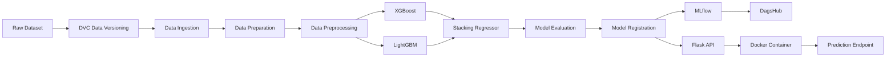

# 🛵 Swiggy Delivery Time Prediction

<p align="center">

**An End-to-End Machine Learning & MLOps Project for Food Delivery Time Prediction**

Predict food delivery time using restaurant and delivery-location coordinates, weather, traffic, vehicle information, and other order-related features.

</p>

<p align="center">


</p>

---

## 📌 Overview

Food delivery time depends on several factors such as:

* 📍 Restaurant and customer location
* 🌦️ Weather conditions
* 🚦 Road traffic density
* 🛵 Vehicle type
* 👨‍🍳 Delivery-person characteristics
* 🕐 Order timing
* 📏 Delivery distance
* 🎉 Festival and weekend effects

This project builds an **end-to-end machine learning pipeline** to predict food delivery time while following reproducible **MLOps practices**.

Instead of relying on a single notebook, the project is organized as a reproducible pipeline using:

* **DVC** for data and pipeline versioning
* **MLflow + DagsHub** for experiment tracking
* **XGBoost & LightGBM** for model training
* **Stacking Ensemble** for combining models
* **Flask** for model serving
* **Docker** for containerization
* **GitHub Actions** for CI/CD

The complete workflow can be reproduced using the project's DVC pipeline.

---

# 🎯 Problem Statement

Food delivery platforms need accurate estimates of how long an order will take to reach the customer.

The objective of this project is to build a regression model that predicts:

> **Estimated food delivery time in minutes**

based on order, delivery, location, weather, traffic, vehicle, and temporal features.

### Input

The model uses information such as:

* Delivery-person age
* Delivery-person rating
* Restaurant coordinates
* Delivery coordinates
* Order date/time
* Weather conditions
* Road traffic density
* Vehicle type
* Type of order
* Festival information
* City type
* Delivery distance
* Order time characteristics

### Output

The model returns an estimated delivery time for the given order.

---

# 🧠 Machine Learning Approach

The project follows a complete machine learning lifecycle:

```text
Raw Dataset
     │
     ▼
Data Ingestion
     │
     ▼
Data Cleaning
     │
     ▼
Train / Test Split
     │
     ▼
Feature Engineering
     │
     ▼
Data Preprocessing
     │
     ▼
Model Training
     │
     ├───────────────┐
     ▼               ▼
  XGBoost         LightGBM
     │               │
     └───────┬───────┘
             ▼
      Stacking Regressor
             │
             ▼
      Model Evaluation
             │
             ▼
       Model Registration
             │
             ▼
        Flask REST API
             │
             ▼
           Docker
```

---

# 🏗️ MLOps Architecture

The project is designed around reproducibility and automation.



---

# 🔄 DVC Pipeline

The complete machine learning workflow is managed through **DVC**.

The pipeline contains the following stages:

```text
data_ingestion
       ↓
data_preperation
       ↓
data_preprocessing
       ↓
train_model
       ↓
evaluate_model
       ↓
register_model
```

Each stage declares its dependencies and parameters.

Running:

```bash
dvc repro
```

automatically determines which stages need to be executed.

This means that if only a specific part of the pipeline changes, DVC can avoid unnecessarily rerunning unaffected stages.

---

# 📊 Dataset

The project works with food delivery data containing information about delivery personnel, orders, locations, weather, traffic, and delivery conditions.

Important feature groups include:

| Feature Group   | Examples                                                   |
| --------------- | ---------------------------------------------------------- |
| Delivery Person | Age, rating                                                |
| Location        | Restaurant latitude/longitude, delivery latitude/longitude |
| Weather         | Sunny, foggy, stormy, windy, etc.                          |
| Traffic         | Low, medium, high, jam                                     |
| Vehicle         | Motorcycle, scooter                                        |
| Order           | Meal, drinks, snack                                        |
| Distance        | Delivery distance                                          |
| Time            | Order time, pickup time, time of day                       |
| Calendar        | Weekend, festival                                          |
| City            | Urban, semi-urban                                          |

The raw dataset is managed through **DVC rather than being directly committed to Git**.

---

# ⚙️ Feature Engineering

Several additional features are generated from the raw data.

### 📍 Delivery Distance

Restaurant and delivery coordinates are used to derive the approximate delivery distance.

```text
Restaurant Location
        +
Delivery Location
        ↓
Distance
```

### 🕐 Time Features

Order timestamps are transformed into useful temporal features such as:

* Order hour
* Time of day
* Weekend indicator
* Pickup duration

### 🚦 Traffic Features

Traffic density is treated as an ordered categorical variable:

```text
Low → Medium → High → Jam
```

### 📏 Distance Categories

Distance can also be categorized into:

```text
Short → Medium → Long → Very Long
```

These engineered features provide the models with more meaningful information than the original raw columns alone.

---

# 🧹 Data Preprocessing

The preprocessing pipeline handles both numerical and categorical variables.

### Numerical Features

Numerical features include variables such as:

* Age
* Ratings
* Pickup time
* Distance

Scaling and transformation are applied through the preprocessing pipeline.

### Categorical Features

Categorical features include:

* Weather
* Type of order
* Type of vehicle
* Festival
* City type
* Weekend
* Order time of day

Categorical variables are encoded using appropriate preprocessing techniques.

### Reproducibility

The fitted preprocessing artifacts are persisted so that the exact same transformations used during training can be applied during inference.

---

# 🤖 Model Development

The project experiments with multiple tree-based gradient boosting models.

## XGBoost

**XGBoost** is used as one of the primary regression models.

Its strengths include:

* Strong performance on tabular datasets
* Regularization
* Efficient gradient boosting
* Good handling of nonlinear relationships

---

## LightGBM

**LightGBM** is another gradient boosting model used in the project.

It provides:

* Fast training
* Efficient memory usage
* Strong performance on structured/tabular data
* Support for complex nonlinear relationships

---

## 🧩 Stacking Ensemble

Instead of relying on a single model, the project combines the predictions of the base learners using a **stacking regressor**.

```text
                ┌────────────┐
Features ──────►│  XGBoost   │─────┐
                └────────────┘     │
                                   ▼
                              ┌───────────┐
                              │ Stacking  │
                              │ Regressor │
                              └─────┬─────┘
                                    │
                                    ▼
                              Final Prediction
                                    ▲
                ┌────────────┐     │
Features ──────►│  LightGBM  │─────┘
                └────────────┘
```

The goal is to combine the strengths of multiple learners and improve predictive performance.

---

# 📈 Experiment Tracking

Model experiments are tracked using **MLflow**.

The project integrates MLflow with **DagsHub** for experiment tracking.

Tracked information can include:

* Model parameters
* Evaluation metrics
* Model artifacts
* Training runs
* Experiment history

This makes it easier to compare experiments and identify the best-performing model.

---

# 🗂️ Data Versioning

**DVC (Data Version Control)** is used to version datasets and ML artifacts.

This allows the project to keep large datasets outside Git while maintaining references to specific dataset versions.

Typical workflow:

```bash
dvc add data/external/food_delivery.csv

git add data/external/food_delivery.csv.dvc

git commit -m "Track dataset with DVC"

dvc push
```

---

# 🚀 Installation

## 1. Clone the Repository

```bash
git clone https://github.com/Sovith07/swiggy_delivery_time.git

cd swiggy_delivery_time
```

---

## 2. Create a Virtual Environment

### Windows

```bash
python -m venv venv

venv\Scripts\activate
```

### Linux / macOS

```bash
python3 -m venv venv

source venv/bin/activate
```

---

## 3. Install Dependencies

```bash
pip install -r requirements.txt
```

For development and CI/CD tooling, install the development dependencies if they are present in your checkout:

```bash
pip install -r dev_requirements.txt
```

---

# 🔐 Environment Variables

The project uses environment variables for external services.

| Variable                | Purpose                            |
| ----------------------- | ---------------------------------- |
| `AWS_ACCESS_KEY_ID`     | Authentication for DVC's S3 remote |
| `AWS_SECRET_ACCESS_KEY` | Authentication for DVC's S3 remote |
| `DAGSHUB_PAT`           | Authentication for MLflow/DagsHub  |

### Example

```bash
export AWS_ACCESS_KEY_ID="your_access_key"
export AWS_SECRET_ACCESS_KEY="your_secret_key"
export DAGSHUB_PAT="your_dagshub_token"
```

> ⚠️ Never commit API keys, cloud credentials, access tokens, or passwords to GitHub.

---

# 🔄 Run the Complete ML Pipeline

After setting up the environment:

```bash
dvc repro
```

This executes the pipeline in dependency order:

```text
Data Ingestion
      ↓
Data Preparation
      ↓
Data Preprocessing
      ↓
Model Training
      ↓
Model Evaluation
      ↓
Model Registration
```

DVC automatically determines which stages need to be rerun based on changes to:

* Source code
* Data
* Pipeline dependencies
* Parameters

---

# 🌐 Run the Prediction API

The inference application is located inside:

```text
flask_app/
```

Run:

```bash
cd flask_app

python app.py
```

The application serves the prediction API on:

```text
http://localhost:8000
```

---

# 🐳 Docker Deployment

The application can be packaged into a Docker container.

## Build the Image

```bash
docker build -t swiggy-delivery-time .
```

## Run the Container

```bash
docker run -d \
  --name swiggy_delivery \
  -p 8000:8000 \
  --restart unless-stopped \
  swiggy-delivery-time
```

The API will then be available through:

```text
http://localhost:8000
```

---

# 🔌 API Usage

The prediction service exposes a REST API for generating delivery-time predictions.

### Endpoint

```text
POST /predict
```

### Example Request

```json
{
    "Delivery_person_Age": "30",
    "Delivery_person_Ratings": "4.8",
    "Restaurant_latitude": "12.9716",
    "Restaurant_longitude": "77.5946",
    "Delivery_location_latitude": "12.9352",
    "Delivery_location_longitude": "77.6245",
    "Order_Date": "19-03-2022",
    "Time_Orderd": "10:30",
    "Time_Order_picked": "10:45",
    "Weatherconditions": "conditions Sunny",
    "Road_traffic_density": "Medium",
    "Vehicle_condition": "2",
    "Type_of_order": "Meal",
    "Type_of_vehicle": "motorcycle",
    "multiple_deliveries": "1",
    "Festival": "No",
    "City": "Urban"
}
```

### Example Response

```json
{
    "prediction": 28.4
}
```

> The exact request schema should match the Pydantic/API validation schema implemented in the current application.

---

# 📁 Project Structure

```text
swiggy_delivery_time/
│
├── .dvc/
│
├── .github/
│   └── workflows/
│       └── ...
│
├── data/
│   ├── external/
│   ├── raw/
│   ├── interim/
│   └── processed/
│
├── flask_app/
│   └── app.py
│
├── models/
│   └── ...
│
├── notebooks/
│   └── ...
│
├── reports/
│   └── figures/
│
├── scripts/
│   └── ...
│
├── src/
│   ├── data/
│   │   ├── data_ingestion.py
│   │   └── preperation.py
│   │
│   ├── features/
│   │   └── ...
│   │
│   └── models/
│       ├── ...
│       └── ...
│
├── Dockerfile
├── dvc.yaml
├── dvc.lock
├── params.yaml
├── requirements.txt
├── dev_requirements.txt
└── README.md
```

---

# 🧪 Reproducibility

One of the primary goals of this project is reproducibility.

The combination of:

```text
Git
 +
DVC
 +
MLflow
 +
Docker
 +
Parameter Configuration
```

allows the ML workflow to be reproduced across different environments.

### Version Control

Git tracks:

* Source code
* Configuration
* Pipeline definitions
* Documentation

### Data Versioning

DVC tracks:

* Large datasets
* Dataset versions
* Model artifacts

### Experiment Tracking

MLflow tracks:

* Experiments
* Parameters
* Metrics
* Artifacts

### Containerization

Docker provides a consistent runtime environment for serving the trained model.

---

# ⚡ Why MLOps?

A machine learning model is only one part of a production ML system.

This project demonstrates the complete lifecycle:

```text
             DATA
              │
              ▼
        Data Versioning
              │
              ▼
       Data Processing
              │
              ▼
       Model Training
              │
              ▼
       Model Evaluation
              │
              ▼
     Experiment Tracking
              │
              ▼
       Model Registration
              │
              ▼
        API Deployment
              │
              ▼
          Docker
              │
              ▼
         Production
```

This approach makes the project more maintainable, reproducible, and deployment-ready than a standalone machine learning notebook.

---

# 🛠️ Technology Stack

| Technology        | Purpose                          |
| ----------------- | -------------------------------- |
| 🐍 Python         | Programming language             |
| 🧠 Scikit-learn   | Machine learning & preprocessing |
| 🚀 XGBoost        | Gradient boosting regression     |
| ⚡ LightGBM        | Gradient boosting regression     |
| 🧩 MLflow         | Experiment tracking              |
| 📦 DVC            | Data & pipeline versioning       |
| 🌐 DagsHub        | MLflow experiment tracking       |
| 🔥 Flask          | REST API                         |
| 🐳 Docker         | Containerization                 |
| ☁️ AWS S3         | DVC remote storage               |
| 🔄 GitHub Actions | CI/CD                            |
| 📓 Jupyter        | Exploratory analysis             |

---

# 📊 Model Evaluation

The project evaluates trained models on held-out test data.

Typical regression metrics include:

* **MAE — Mean Absolute Error**
* **RMSE — Root Mean Squared Error**
* **R² — Coefficient of Determination**

### MAE

Measures the average absolute difference between actual and predicted delivery time.

```text
MAE = average(|actual - predicted|)
```

Lower is better.

### RMSE

Penalizes larger prediction errors more strongly.

```text
RMSE = √average((actual - predicted)²)
```

Lower is better.

### R²

Measures how much of the variance in the target variable is explained by the model.

Higher is generally better.

> Model metrics should be taken from the tracked MLflow/DVC run rather than hard-coded into the README so that the documentation remains consistent with the latest experiment.

---

# 🔮 Future Improvements

Potential improvements include:

* [ ] Add automated model retraining
* [ ] Add model monitoring
* [ ] Add prediction drift detection
* [ ] Add automated testing for the API
* [ ] Add API documentation with Swagger/OpenAPI
* [ ] Add model performance dashboards
* [ ] Improve CI/CD deployment automation
* [ ] Add cloud-native deployment
* [ ] Add automated data-quality checks
* [ ] Add feature-importance visualization
* [ ] Add real-time prediction monitoring
* [ ] Add automated model selection

---

# 🚀 Production Workflow

The intended production workflow can be summarized as:

```text
Developer
    │
    ▼
GitHub Repository
    │
    ▼
GitHub Actions
    │
    ├──────────────► Tests
    │
    ├──────────────► DVC Pipeline
    │
    └──────────────► Build Docker Image
                         │
                         ▼
                    Model API
                         │
                         ▼
                    Prediction
```

This makes it possible to move from:

**data → model → experiment → API → container → deployment**

using a repeatable workflow.

---

# 📌 Key Takeaways

This project demonstrates practical experience with:

### Machine Learning

* Regression
* Feature engineering
* Data preprocessing
* XGBoost
* LightGBM
* Ensemble learning

### MLOps

* DVC pipelines
* Data versioning
* Experiment tracking
* MLflow
* DagsHub
* Model registration
* Reproducible workflows

### Deployment

* Flask REST API
* Docker
* Containerized inference
* CI/CD

---

# 👨‍💻 Author

**Sovith Kumar Singh**

GitHub: [@Sovith07](https://github.com/Sovith07)

Portfolio: [sovith07.github.io](https://sovith07.github.io/)

LinkedIn: [Sovith Kumar Singh](https://www.linkedin.com/)

---

# ⭐ If You Find This Project Useful

If you found this project useful or interesting, consider giving it a ⭐ on GitHub.

It helps support further development and motivates me to build more practical **Machine Learning & MLOps projects**.

---

## 📄 License

No license is currently specified for this repository.

If you intend to make the project openly reusable, consider adding an appropriate license such as the **MIT License**.

---

<p align="center">

**Built with Python • Machine Learning • MLOps • DVC • MLflow • Docker**

</p>
